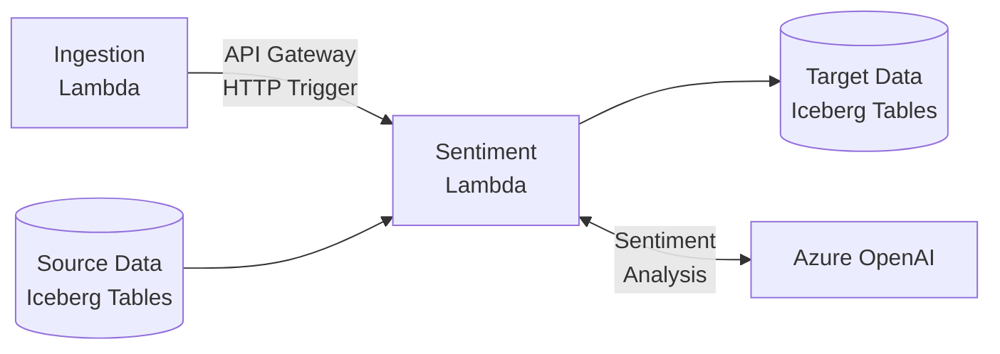
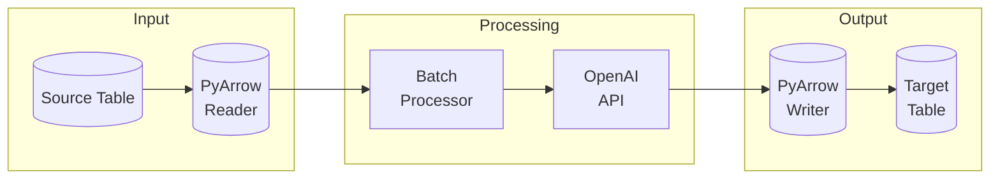

# PTData Social Media Enrichment

A modular AWS Lambda-based system for enriching social media data using Azure OpenAI's language models, with Apache Iceberg for data storage and PyArrow for efficient data processing.

## TODO!

- [ ] Fix timeout
- [ ] Github workflow for redeploying on change

## Architecture Overview

### Core Components

1. **Connectors Module** ([`src/connectors/`](src/connectors/README.md))
   - Asynchronous AWS integration using aioboto3
   - Apache Iceberg table management via pyiceberg
   - PyArrow-based data processing
   - Concurrent source table reading
   - Incremental processing support

2. **Inference Module** ([`src/inference/`](src/inference/README.md))
   - Azure OpenAI integration for batch processing
   - Semaphore-based rate limiting with exponential backoff
   - PyArrow table input/output
   - Pydantic models for response validation

3. **Common Module** ([`src/common/`](src/common/README.md))
   - Component factory pattern implementation
   - Pydantic-based configuration system
   - Type-safe configuration validation
   - Shared utilities and type definitions

4. **Lambda Jobs** ([`config/`](config/README.md))
   - Generic Lambda handler with dynamic job loading
   - Job-specific configurations and implementations
   - Sentiment analysis processing pipeline
   - AWS Secrets Manager integration


### System Overview



### Detailed Data Flow



### Optimizations

#### Performance
- Concurrent data loading and processing with asyncio
- Memory-efficient PyArrow tables

#### Cost
- Iceberg metadata filtering
- Efficient batch sizes
- Lambda memory tuning
- PyArrow optimizations


## Setup and Installation

### Prerequisites

- Python 3.11+
- Poetry for dependency management
- AWS and SAM CLIs
- AWS account with appropriate permissions

### Installation

```bash
# Install dependencies
poetry install

# Configure AWS credentials
aws configure

# Set up environment variables
cp .env.example .env
# Edit .env with your settings
```
