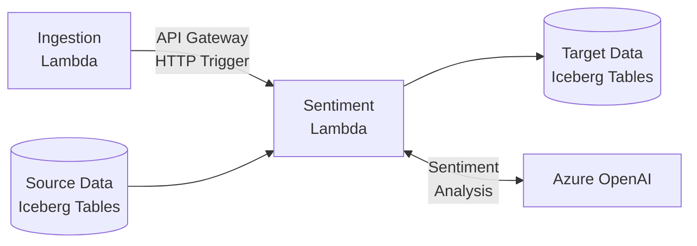
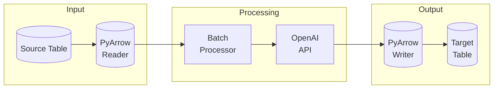

# PTData Social Media Enrichment

A modular AWS Lambda-based system for enriching social media data using Azure OpenAI's language models, with Apache Iceberg for data storage and PyArrow for efficient data processing.

## Architecture Overview

### Core Components

1. **Connectors Module** ([`src/connectors/`](src/connectors/README.md))
   - Asynchronous AWS integration using aioboto3
   - Apache Iceberg table management via pyiceberg
   - PyArrow-based data processing
   - Concurrent source table reading
   - Incremental processing support
   - Type conversion between Python, Iceberg, and PyArrow

2. **Inference Module** ([`src/inference/`](src/inference/README.md))
   - Azure OpenAI integration for batch processing
   - Semaphore-based rate limiting with exponential backoff
   - PyArrow table input/output
   - Pydantic models for response validation
   - Sentiment analysis implementation

3. **Common Module** ([`src/common/`](src/common/README.md))
   - Component factory pattern implementation
   - Pydantic-based configuration system
   - Type-safe configuration validation
   - Shared utilities and type definitions

4. **Lambda Jobs** ([`jobs/`](jobs/README.md))
   - Generic Lambda handler with dynamic job loading
   - Job-specific configurations and implementations
   - Sentiment analysis processing pipeline
   - AWS Secrets Manager integration

### Key Features

- **Modular Design**: Factory pattern for extensible components (see [`src/common/`](src/common/README.md))
- **Type Safety**: Pydantic models throughout the stack
- **Data Processing**: PyArrow and Iceberg integration (see [`src/connectors/`](src/connectors/README.md))
- **AI Integration**: Azure OpenAI with rate limiting (see [`src/inference/`](src/inference/README.md))
- **Job Framework**: Lambda-based processing (see [`jobs/`](jobs/README.md))

### System Overview



### Detailed Data Flow



### Optimizations

#### Performance
- Concurrent data loading with asyncio
- Memory-efficient PyArrow tables
- Smart batching (? records/request)
- Rate limiting with backoff

#### Cost
- Iceberg metadata filtering
- Efficient batch sizes
- Lambda memory tuning
- PyArrow optimizations

### Future Work

#### Near-term
- Adaptive batch sizing
- Dead letter queues
- Cost tracking
- Circuit breakers

#### Long-term
- Streaming support
- Custom embeddings
- Real-time processing
- Result caching

## Configuration

The system uses a hierarchical configuration system:

### 1. Job Configuration (`jobs/sentiment/config.yaml`)
```yaml
connector:
  warehouse: s3://aws-orf-social-media-analytics/dev/gold
  source:
    tables:
      - database: dev_gold
        table: fact_social_media_reaction_post
    time_filter_hours: 300
    max_records: 30
  target:
    database: dev_test
    table: social_media_sentiment

inference:
  workers: 20
  response_format: sentiment
```

### 2. AWS Configuration (`template.yaml`)
- Lambda function definitions
- IAM roles and permissions
- Resource allocations

### 3. Component Configurations
- Connector settings (see [`src/connectors/README.md`](src/connectors/README.md))
- Inference settings (see [`src/inference/README.md`](src/inference/README.md))
- Model configurations (see [`src/inference/models/`](src/inference/README.md#models))

## Setup and Installation

### Prerequisites

- Python 3.12+
- Poetry for dependency management
- AWS CLI and SAM CLI
- AWS account with appropriate permissions

### Installation

```bash
# Install dependencies
poetry install

# Configure AWS credentials
aws configure

# Set up environment variables
cp .env.example .env
# Edit .env with your settings
```

## Development

### Local Development

```bash
# Run tests
poetry run pytest

# Format and lint
poetry run ruff format .
poetry run ruff check .

# Type checking
poetry run mypy .
```

### Local Testing

```bash
# Test specific job
cd jobs/sentiment
python main.py

# Test with SAM
sam local invoke -e events/sentiment.json
```

## Deployment

### Using AWS SAM

```bash
# Build and deploy
sam build
sam deploy --guided  # First time
sam deploy          # Subsequent deployments
```

## Component Details

### Connectors ([`src/connectors/`](src/connectors/README.md))
- Iceberg table management
- PyArrow data processing
- Incremental processing
- Type conversion system

### Inference ([`src/inference/`](src/inference/README.md))
- Azure OpenAI integration
- Batch processing
- Rate limiting
- Response validation

### Common ([`src/common/`](src/common/README.md))
- Component factories
- Configuration system
- Type definitions
- Shared utilities

### Jobs ([`jobs/`](jobs/README.md))
- Lambda integration
- Dynamic job loading
- Sentiment analysis
- Configuration management

## Security

- Secrets via AWS Secrets Manager
- IAM roles with least privilege
- Environment-specific configs
- Secure API key handling

## Best Practices

1. **Configuration**
   - Use YAML for readability
   - Validate with Pydantic
   - Separate concerns

2. **Development**
   - Follow type hints
   - Write unit tests
   - Document changes

3. **Deployment**
   - Use SAM for consistency
   - Monitor resources
   - Review permissions

4. **Data Processing**
   - Use batch processing
   - Handle errors gracefully
   - Monitor performance

## Contributing

1. Fork the repository
2. Create a feature branch
3. Make your changes
4. Run tests and linting
5. Submit a pull request

## License

[Add your license information here]
