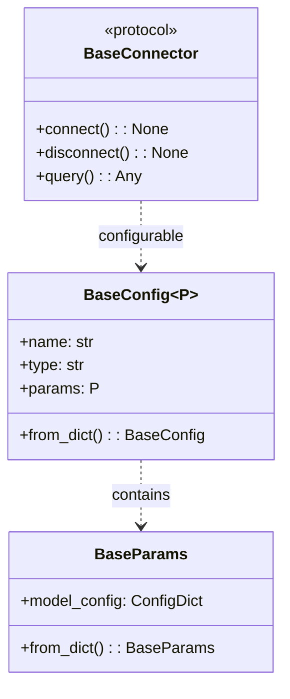

# Common Types and Configuration Design

This package provides the base configuration and parameter types used throughout the project. The design follows a hierarchical pattern that enables type-safe, extensible configurations for different components.

## Configuration Design

### Base Parameters and Configuration

The configuration system is built around two core classes:

1. **`BaseParams`**: A base class for component-specific parameters
   - Enforces strict parameter validation
   - Prevents extra fields using `extra="forbid"`
   - Provides a `from_dict()` method for flexible instantiation

2. **`BaseConfig`**: A generic configuration class
   - Supports type-parameterized configurations
   - Includes name, type, and parameters
   - Provides robust configuration creation with `from_dict()`

## Mermaid Class Diagram



## Python Type System and Generics

### TypeVar and Generic Types

```python
# Generic type parameter bound to BaseModel
P = TypeVar("P", bound=BaseModel)

# Generic base class with type parameter
class BaseConfig(BaseModel, Generic[P]):
    params: P  # P must be a subclass of BaseModel
```

Key points about `TypeVar` and generics:
- `TypeVar` creates a type variable that can be constrained
- `bound=BaseModel` ensures the type parameter is a subclass of BaseModel
- `Generic[P]` allows creating type-parameterized classes
- Provides compile-time type checking and better IDE support

## Design Principles

1. **Flexible Configuration**: 
   - `BaseConfig` provides a generic configuration structure
   - Supports dynamic configuration with `from_dict()` methods

2. **Protocol-Based Design**:
   - `BaseConnector` defines a protocol for data source interactions
   - Allows for flexible implementation across different connectors

## Usage Example

```python
# Defining a custom configuration
class MyParams(BaseParams):
    specific_field: str

class MyConfig(BaseConfig[MyParams]):
    pass

# Creating a configuration instance
config = MyConfig(
    name="example",
    type="custom",
    params=MyParams(specific_field="value")
)
```

## Connector Implementation

Connectors implement the `BaseConnector` protocol, which defines:
- `connect()`: Establish a connection
- `disconnect()`: Close the connection
- `query()`: Execute data retrieval or manipulation operations

This design ensures type safety, extensibility, and a consistent interface across different data source connectors.
